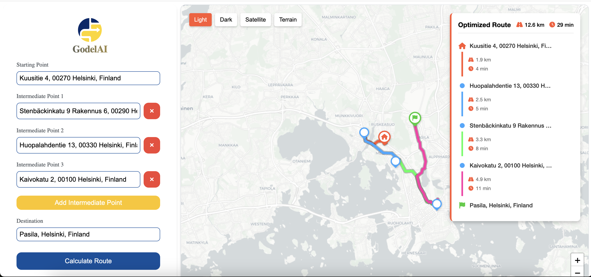

# Short Path Navigation


An interactive map-based application for optimizing delivery routes. This tool helps users find the shortest path between multiple locations, making it ideal for delivery planning, logistics optimization, and route management.

## 🚀 Live Demo

Visit the application: [Short Path Navigation](https://short-path-navigation.vercel.app)



## ✨ Features

- **Interactive Map Interface**: Drag and drop markers to set locations
- **Route Optimization**: Calculate the most efficient route between multiple points
- **Visual Route Display**: Clear visualization of the optimized path with connection dots
- **Detailed Route Information**: Distance and time estimates for each segment
- **Multiple Map Styles**: Choose between light, dark, satellite, and terrain views
- **Responsive Design**: Works seamlessly on desktop and mobile devices
- **Real-time Calculations**: Instant feedback as you modify your route

## 🛠️ Tech Stack

- **Frontend**: React 19 with TypeScript
- **Routing**: Custom route optimization algorithms
- **Maps**: Leaflet with React-Leaflet integration
- **Styling**: SASS Modules for component-scoped styles
- **Build Tool**: Vite for fast development and optimized production builds
- **Testing**: Vitest for unit and component testing
- **Code Quality**: ESLint and Prettier for consistent code style
- **CI/CD**: GitHub Actions for automated testing and deployment to Vercel

## 🏁 Getting Started

### Prerequisites

- Node.js (v18 or higher)
- npm or yarn

### Installation

1. Clone the repository

```bash
git clone https://github.com/thamanchand/short-path-navigation.git
cd short-path-navigation
```

2. Install dependencies

```bash
npm install
```

3. Start the development server

```bash
npm run dev
```

The application will be available at `http://localhost:5173`

## 📋 Available Scripts

- `npm run dev` - Start the development server
- `npm run build` - Build the application for production
- `npm run lint` - Run ESLint to check code quality
- `npm run lint:fix` - Fix linting issues automatically
- `npm run test` - Run tests with Vitest
- `npm run type-check` - Check TypeScript types
- `npm run preview` - Preview the production build locally

## 📁 Project Structure

```
src/
├── components/     # UI components including Map and RouteForm
├── hooks/          # Custom React hooks for shared logic
├── services/       # API and data services
├── styles/         # Global styles and variables
├── types/          # TypeScript type definitions
└── utils/          # Utility functions
```

## 🔄 Development Workflow

The project follows a structured development workflow:

1. **Feature Development**: Create a new branch for each feature
2. **Testing**: Write tests for new functionality
3. **Code Review**: Submit a pull request for review
4. **CI/CD**: Automated testing and deployment via GitHub Actions
5. **Deployment**: Automatic deployment to Vercel when merged to main

## 🌟 Key Features Explained

### Route Optimization

The application uses an efficient algorithm to calculate the optimal route between multiple points, considering factors like distance and estimated travel time.

### Interactive Map

The map component provides a rich user experience with:

- Draggable markers for location selection
- Visual representation of the route with colored segments
- Connection dots for improved visual clarity
- Custom markers for source, destination, and intermediate points

### Route Legend

A detailed legend displays:

- Total distance and duration
- Step-by-step navigation with segment information
- Vertical scrolling for routes with many points

## 🔮 Future Improvements

- Add real-time traffic data integration
- Implement multiple route alternatives
- Add support for different transportation modes
- Enhance mobile experience with responsive optimizations
- Add user accounts for saving favorite routes
- Implement offline support with service workers

## 📄 License

This project is licensed under the MIT License - see the LICENSE file for details.

## 👨‍💻 Author

Thaman Chand - [GitHub](https://github.com/thamanchand)
